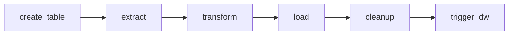
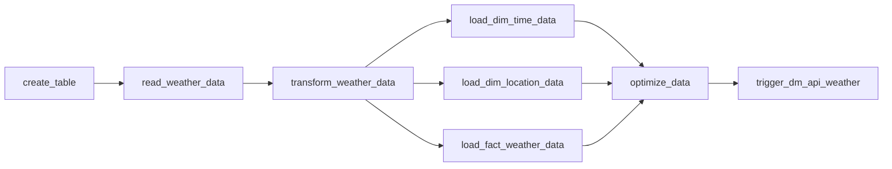

# ETL Pipeline with Apache Airflow


這個專案使用 Apache Airflow 建立一個 ETL 管道。主要目標是從中央氣象署接取 36 小時的天氣預報、轉換成需求的格式，然後寫入 ClickHouse 資料庫中。並排程每六個小時更新最新資訊。

#### 系統需求

在開始之前，請確保已安裝：

- **Docker Community Edition (CE)** - 建議至少分配 4GB 記憶體給 Docker Engine（理想為 8GB）
- **Docker Compose v2.14.0** 或更新版本

> 💡 **提示**: 在 macOS 上，預設的 Docker 記憶體可能不足以運行 Airflow。如果記憶體不足，可能會導致 webserver 持續重啟。
>
> 檢查可用記憶體：
>
> ```bash
> docker run --rm "debian:bookworm-slim" bash -c 'numfmt --to iec $(echo $(($(getconf _PHYS_PAGES) * $(getconf PAGE_SIZE))))'
> ```

#### 快速開始

**1. 初始化環境**

在第一次啟動前，請先執行初始化腳本來準備必要的目錄和配置文件：

```bash
./setup.sh
```

這個腳本會自動執行官方文檔中的所有預啟動步驟：

1. **設置正確的 Airflow 用戶** (Setting the right Airflow user)

   - 創建必要的目錄：`dags/`, `logs/`, `plugins/`, `config/`
   - 創建 `.env` 文件並設置 `AIRFLOW_UID` 環境變數

2. **初始化 airflow.cfg** (可選)

   - 可選擇是否初始化 `airflow.cfg` 配置文件

3. **初始化資料庫** (Initialize the database)
   - 執行資料庫遷移
   - 創建第一個管理員帳號（預設：`airflow` / `airflow`）


**2. 構建 Docker 鏡像（首次或更新依賴後）**

如果使用自定義 Dockerfile（包含 `requirements.txt` 中的依賴），需要先構建鏡像：

```bash
docker compose up -d
```

**3. 訪問 Airflow Web UI**

- **URL**: http://localhost:8080
- **預設帳號**: `airflow`
- **預設密碼**: `airflow`

**4. 常用命令**

```bash
# 查看服務狀態
docker-compose ps

# 查看日誌
docker-compose logs -f

# 停止服務
docker-compose down

# 停止服務並刪除 volumes（清理資料）
docker-compose down -v
```

> 📚 **參考文檔**: 更多詳細資訊請參考 [Apache Airflow 官方文檔](https://airflow.apache.org/docs/apache-airflow/stable/howto/docker-compose/index.html)

#### 項目結構

```
ETL-with-Apache-Airflow/
├── dags/                             # DAG 文件目錄
│   ├── ods/                          # ODS 層 DAG
│   │   ├── api_get_weather_dag.py    # ODS 層 ETL 管道定義
│   │   └── api_get_weather_etl.py    # ODS 層 ETL 邏輯
│   ├── dw/                           # DW 層 DAG
│   │   ├── api_get_weather_dag.py    # DW 層 ETL 管道定義
│   │   └── api_get_weather_etl.py    # DW 層 ETL 邏輯
│   ├── dm/                           # DM 層 DAG
│   │   ├── api_get_weather_dag.py    # DM 層 ETL 管道定義
│   │   └── api_get_weather_etl.py    # DM 層 ETL 邏輯
│   ├── common/                       # 共用工具
│   ├── configs/                      # 配置檔案
│   └── temp_data/                    # 臨時數據存儲目錄
├── logs/                             # Airflow 日誌目錄
├── plugins/                          # 自定義插件目錄
├── config/                           # Airflow 配置文件目錄
│   └── airflow.cfg                   # Airflow 配置文件
├── docker-compose.yaml               # Docker Compose 配置
├── Dockerfile                        # 自定義 Docker 鏡像定義
├── requirements.txt                  # Python 依賴列表
├── env.example                       # 環境變數模板
├── .gitignore                        # Git 忽略文件
├── setup.sh                          # 初始化腳本
└── README.md                         # 項目說明文檔
```

#### 依賴管理

本項目使用 Docker 自定義鏡像來管理 Python 依賴，確保在不同環境中有一致的運行環境。

**添加新的 Python 依賴：**

1. 編輯 `requirements.txt`，添加所需的套件：
   ```txt
   # 例如添加新的庫
   beautifulsoup4>=4.12.0
   ```

2. 重新構建 Docker 鏡像：
   ```bash
   docker compose build
   ```

3. 重啟服務：
   ```bash
   docker compose up -d --build
   ```

**當前依賴：**

- `airflow-clickhouse-plugin` - ClickHouse 連接器
- `clickhouse-connect` - ClickHouse Python 客戶端
- `pandas` - 數據處理
- `requests` - HTTP 請求
- `python-dotenv` - 環境變數管理

詳細依賴列表請查看 `requirements.txt`。

#### 環境配置

**1. Airflow 環境變數**

複製環境變數模板並根據需要修改：

```bash
cp env.example .env
# 編輯 .env 文件，設置 AIRFLOW_UID 等變數
```

**2. ClickHouse 連接配置**

在 Airflow Web UI 中創建 ClickHouse 連接，或使用以下命令：

```bash
airflow connections add clickhouse_default \
  --conn-type clickhouse \
  --conn-host host \
  --conn-login user \
  --conn-password assword \
  --conn-port 9000 \
  --conn-schema default
```

#### 資料來源

資料來源是氣象資料開放平臺[一般天氣預報-今明 36 小時天氣預報](https://opendata.cwb.gov.tw/dataset/all/F-C0032-001)，來源中會包含各縣市在未來 36 小時內逐 12 小時的天氣現象、最高氣溫、最低氣溫、降雨機率及舒適度指數。以 API 的形式串接 JSON 格式資料。

#### 資料管線設計

本專案採用**分層架構**，包含 ODS（操作型資料儲存）層、DW（資料倉儲）層和 DM（資料市場）層：

**ODS 層管線** (`ods_api_weather` DAG):



**DW 層管線** (`dw_api_weather` DAG):



**DM 層管線** (`dm_api_weather` DAG):

