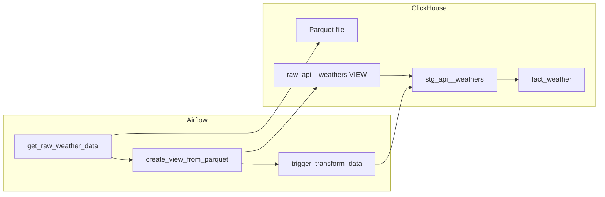

# ETL Pipeline with Apache Airflow


以 Apache Airflow 編排、從中央氣象署 API 取得天氣預報，寫入 ClickHouse 後由 dbt 進行轉換與建模的 ETL 管道。每六小時自動更新。

---

## 技術棧

| 元件               | 用途                                                  |
| ------------------ | ----------------------------------------------------- |
| **Apache Airflow** | 排程與管線編排（CeleryExecutor + PostgreSQL + Redis） |
| **ClickHouse**     | 分析型資料庫，存放 raw view 與 dbt 產出的表           |
| **dbt**            | 於 ClickHouse 上進行 staging / mart 轉換與建模        |
| **Python**         | 擷取 API、寫入 Parquet（pandas、requests）            |

---

## 資料來源

[氣象資料開放平臺 - 一般天氣預報（今明 36 小時）](https://opendata.cwb.gov.tw/dataset/all/F-C0032-001)  
API 回傳各縣市未來 36 小時、每 12 小時一筆的天氣現象、最高/最低溫、降雨機率、舒適度等，以 JSON 串接。

---

## 架構概覽

整體為 **Raw（Landing）→ dbt Staging → dbt Mart**：

1. **Airflow DAG `raw_api_weather`**
   - 呼叫氣象署 API，將結果存成 Parquet。
   - 在 ClickHouse 建立 **view**，直接讀取該 Parquet 檔（`raw_api__weathers`），作為 dbt 的 landing 來源。
   - 觸發 dbt 執行 `stg_api__weathers+`（staging 與下游 mart）。

2. **dbt（ClickHouse）**
   - **Staging**：`stg_api__weathers`（view）— 從 `raw_api__weathers` 做欄位整理與 pivot。
   - **Mart**：`fact_weather`（MergeTree 表）— 產出地點、時段、天氣描述、雨率、溫度、溫差、活動建議等欄位。


```mermaid
graph LR
  subgraph Airflow
    A[get_raw_weather_data] --> B[create_view_from_parquet]
    B --> C[trigger_transform_data]
  end
  subgraph ClickHouse
    D[Parquet file]
    E[raw_api__weathers VIEW]
    F[stg_api__weathers]
    G[fact_weather]
  end
  A --> D
  B --> E
  C --> F
  E --> F
  F --> G
```

---

## 專案結構

| 路徑                  | 說明                                                    |
| --------------------- | ------------------------------------------------------- |
| `dags/api/`           | 天氣 DAG（`weather_dag.py`）與 ETL 邏輯（`weather.py`） |
| `dags/configs/`       | 共用設定（API URL、金鑰、暫存路徑等）                   |
| `dbt/`                | dbt 專案（profile、models、sources）                    |
| `dbt/models/staging/` | Staging 模型與 source 定義                              |
| `dbt/models/mart/`    | Mart 模型（如 `fact_weather`）                          |
| `docker-compose.yaml` | Airflow 叢集、ClickHouse、dbt-dev 等服務                |
| `Dockerfile`          | 自訂 Airflow 映像（含 Python 依賴）                     |
| `requirements.txt`    | Airflow 容器內 Python 依賴                              |
| `env.example`         | 環境變數範例（含 ClickHouse、AUTHORIZATION）            |

---

## 開始

```bash
./setup.sh
docker compose up -d
```

- **Airflow UI**：http://localhost:8080
- **帳號 / 密碼**：`airflow` / `airflow`
- **ClickHouse HTTP**：http://localhost:8123（若需對外查詢）

將 `env.example` 複製為 `.env`，並設定：

---
