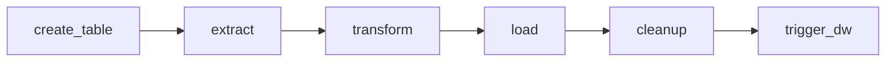
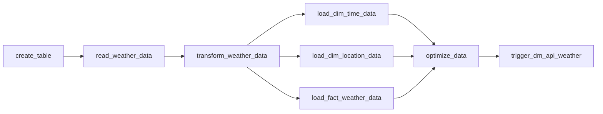

# ETL Pipeline with Apache Airflow


用 Apache Airflow 實作的 ETL 管道：從中央氣象署取得 36 小時天氣預報，經轉換後寫入 ClickHouse，並每六小時自動更新。

---

## 技術棧

- **Apache Airflow** — 排程與管線編排
- **ClickHouse** — 分析型資料庫
- **Python** — ETL 邏輯（pandas、requests 等）

---

## 資料來源

[氣象資料開放平臺 - 一般天氣預報（今明 36 小時）](https://opendata.cwb.gov.tw/dataset/all/F-C0032-001)  
API 回傳各縣市未來 36 小時、每 12 小時一筆的天氣現象、最高/最低溫、降雨機率、舒適度等，以 JSON 串接。

---

## 管線設計

採用 **ODS → DW → DM** 分層架構：

**ODS 層**（`ods_api_weather`）— 擷取、轉換、載入原始資料並觸發 DW：


```mermaid
graph LR
A[create_table] --> B[extract] --> C[transform] --> D[load] --> E[cleanup] --> F[trigger_dw]
```

**DW 層**（`dw_api_weather`）— 維度與事實表建置：


```mermaid
graph LR
A[create_table] --> B[read_weather_data]
B --> C[transform_weather_data]
C --> D[load_dim_time_data]
C --> E[load_dim_location_data]
C --> G[load_fact_weather_data]
D --> F[optimize_data]
E --> F
G --> F
F --> H[trigger_dm_api_weather]
```

**DM 層**（`dm_api_weather`）— 彙總與優化：


```mermaid
graph LR
A[create_table] --> B[load_weather_summary] --> C[optimize_data]
```

---

## 快速開始

```bash
./setup.sh               # 首次：初始化目錄與配置
docker compose up -d     # 啟動服務
```

- **Airflow UI**: http://localhost:8080
- **帳號 / 密碼**: `airflow` / `airflow`

環境變數與 ClickHouse 連線可參考 `env.example`，或在 Airflow Web UI 中設定 Connection。

---

## 專案結構概覽

| 目錄／檔案                      | 說明              |
| ------------------------------- | ----------------- |
| `dags/ods/`                     | ODS 層 DAG 與 ETL |
| `dags/dw/`                      | DW 層 DAG 與 ETL  |
| `dags/dm/`                      | DM 層 DAG 與 ETL  |
| `dags/common/`, `dags/configs/` | 共用工具與設定    |
| `docker-compose.yaml`           | 服務編排          |
| `requirements.txt`              | Python 依賴       |
